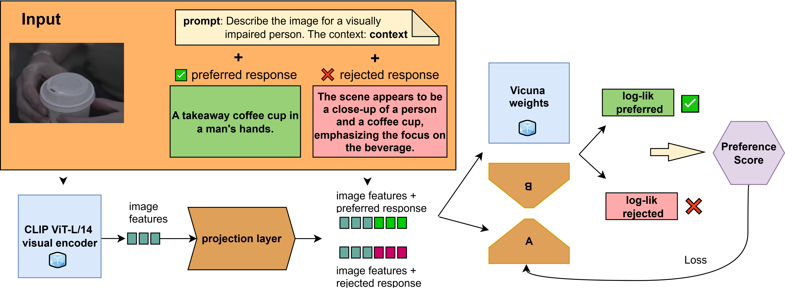

# Alternative text generation
This repository contains data and training scripts for fine-tuning **LLaVA-7B** to generate image descriptions tailored for blind and low-vision (BLV) users. The model is fine-tuned on preference data (alternative text vs. captions) using **LoRA** for parameter-efficient adaptation and **DPO** for alignment with BLV users’ preferences.

**Accessibilité visuelle et éducation inclusive: Étude préliminaire sur la génération de textes alternatifs :**  [Link to paper](https://ia-edu.lis-lab.fr/doc/articles/IA-%C3%89DU_2025_paper_205.pdf)


<p align="center">
  
</p>

## Repository structure

|-- data
|   `-- final_data_all

|-- training
|   |-- config.yaml
|   |   - Configuration file for training hyperparameters, LoRA and DPO settings.
|   |-- config_loader.py
|   |   - Script to load and parse the configuration file.
|   |-- main.py
|   |   - Main entry point for training the model; handles dataset loading, model initialization, and training loop.
|   |-- train.py
|   |   - Core training script for LoRA and DPO fine-tuning.
|   `-- requirements.txt
|       - Python dependencies required for training.

|-- model
|   `-- best_model.pt
|       - Checkpoint of the best-performing fine-tuned LLaVA-7B model.

## Requirements

Install the necessary Python dependencies to run the training scripts:

```bash
# Navigate to the training folder
cd training
# Install dependencies
pip install -r requirements.txt
```

## Data
Contains the JSONL file with prompts and preference data, already split into sections.  
It is a combination of the **Concadia dataset** [1] and the **AD2AT-MD dataset** [2].  

For negative references in the preference data:  
- **Concadia**: 60% uses the original captions, and 40% uses generated descriptions from LLaVA-7B, which have been shown to be long and speculative [2] and therefore unsuitable for BLV users.  
- **AD2AT-MD**: all generated alternative text is used for the negative references.

| Dataset       |   Train  |    Dev  |   Test   | Total (%) |
|---------------|----------|---------|----------|-----------|
| Concadia      | 50 492   | 6 559   | 6 711    | 94,82 %   |
| AD2AT-MD      | 2 658    | 123     | 708      | 5,18 %    |

To access the images:
- Concadia: Download resized.zip from the official Concadia repository (https://github.com/elisakreiss/concadia/tree/master/Concadia_dataset)
- AD2AT-MD: Follow the directions on the official AD2AT-MD repository (https://github.com/eliselinc/AD2AT/)

## References

[1] Lincker, E., Olamisan, E., Pazakou, T., Gouiffès, M., Guinaudeau, C., & Dufaux, F. (2025). Accessibilité visuelle et éducation inclusive : Étude préliminaire sur la génération de textes alternatifs.
[2] Kreiss, E., Fang, F., Goodman, N. D., & Potts, C. (2022). Concadia : Towards Image-Based Text Generation with a Purpose (arXiv:2104.08376). arXiv. https://doi.org/10.48550/arXiv.2104.08376
[3] Lincker, E., Guinaudeau, C., & Satoh, S. (2025). AD2AT : Audio Description to Alternative Text, a Dataset of Alternative Text from Movies. Lecture Notes in Computer Science, 15520, 58‑71. https://doi.org/10.1007/978-981-96-2054-8_5


